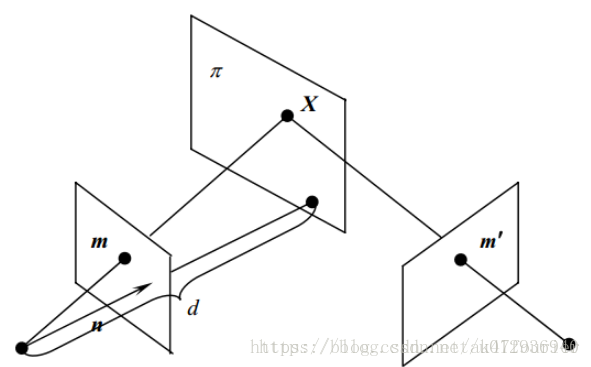

# ComputeHomography——Designed by 叶培楚

**算法流程**

1. 读取图像；
2. 读取相机内参;
3. 提取特征点;
4. 特征点匹配;
5. 计算单应矩阵；
6. 从单应矩阵中计算相机相对位姿；
7. 验证误差。

### 单应矩阵原理

&ensp; &ensp; 单应（透射变换）是射影几何中的概念，又称为射影变换。他把一个射影平面上的点映射到另一个平面对应的位置，并且把直线映射为直线，具有保线性质。与对极几何不同的是，对极几何将点映射到线上，而单应矩阵是点对点的关系。要注意的是单应矩阵的适用场景为：当场景中的特征点都落在同一平面上，比如墙、地面等，此时可用单应性估计运动。

&ensp; &ensp; 单应（透射变换）可以看成是仿射变换的拓展。仿射变换在图形中的变换包括：平移、缩放、旋转、斜切及它们的组合形式。这些变换的特点是：平行关系和线段的长度比例保持不变，即保持物体的平直性。而单应中也存在上述多种变换的组合形式，但是差别在于单应并不一定能保持平行关系和线段的长度比例不变。单应的特点是共面点成像，即单应变换是将某一块共面的地方变换到另外一个地方，但是多数情况下都会彻底改变物体位置和形状。

**平面表示方法**：

&ensp; &ensp; 首先需要确定一个平面法向量为 $\mathbf{\vec{n}} = [n_{1}, n_{2}, n_{3}]^{T}$，但是确定法向量并不能唯一确定一个平面。我们会得到无数多的相互平行的平面。为了唯一确定一个平面，我们还需要一个点，若平面上有一个定点 $\mathbf{x} = [x_{1}, x_{2}, x_{3}]^{T}$, 那么我们即可确定一个平面。
&ensp; &ensp; 假设平面上任意一点为 $\mathbf{m} = \{x, y, z\}$，平面方程为 
$$Ax + By + Cz + D = 0$$

由于法向量已知，则上述方程可以表示成：
$$\mathbf{\vec{n}^{T}} \mathbf{m} + D = 0$$

显然上述的方程表示的是无数组平行的平面，确定 $D$ 即可确定唯一平面。则利用上述所说的平面上的任意动点 $x$，则有：
$$D = -\mathbf{\vec{n}^{T}}\mathbf{x} = -(n_{1}x_{1} + n_{2}x_{2} + n_{3}x_{3})$$

则平面的唯一表示方法为：    

$$Ax + Bx + Cz = (n_{1}x_{1} + n_{2}x_{2} + n_{3}x_{3})$$

综上，为了表示一个平面，我们需要一个法向量，以及一个平面上的点（目的是为了求偏置）。

**单应矩阵**

&ensp; &ensp; 由上述可知平面的表示方法可以写成：
$$\mathbf{\vec{n}}^{T}\mathbf{x} = d$$

&ensp; &ensp; 参考[对极几何及单应矩阵](https://blog.csdn.net/u012936940/article/details/80723609)这篇文章，我们可以得到单应约束图像：

假设左边为第一个相机坐标系 $C_{1}$，右边为第二个相机坐标系 $C_{2}$。并且平面 $\pi$ 在第一个相机坐标系的法向量为 $\mathbf{\vec{n}}$，$C_{2}$ 到平面 $\pi$ 的距离为 $d$。假设平面中任意一个点 $\mathbf{X}$ 在第一个相机坐标系中的表示为 $\mathbf{X_{1}}$，则平面 $\pi$ 的表示方法为：
$$\mathbf{\vec{n}}^{T} \mathbf{X_{1}} = d$$

显然，上面的表示方法满足我们前面介绍的平面表示方法的约束条件，即一个法向量以及平面内有一个已知点。接着我们将平面 $\pi$ 的表示方法改变一下：
$$\frac{1}{d}\mathbf{\vec{n}}^{T} \mathbf{X_{1}} = 1$$

假设平面 $\pi$ 中有一空间点 $X$，对应两个相机的投影像素分别为 $\mathbf{p_{1}}, \mathbf{p_{2}}$，归一化平面中的坐标系为 $\mathbf{x_{1}},\mathbf{{x_{2}}}$，并且满足条件 $s_{1}\mathbf{x_{1}} = \mathbf{X_{1}}$，其中 $s_{1}$ 为 $X_{1}$ 的深度值。若已知两个坐标系之间的相对变换为 $\mathbf{R}, \mathbf{t}$，表示从相机坐标系 $1$ 变换到相机坐标系 $2$，则有：
$$s_{2}\mathbf{x_{2}} = s_{1}\mathbf{R}\mathbf{x_{1}} + \mathbf{t}$$

将平面 $\pi$ 的信息代入上述方程中得到：
$$s_{2}\mathbf{x_{2}} 
    = s_{1}\mathbf{R}\mathbf{x_{1}} + \frac{s_{1}}{d}\mathbf{t}\mathbf{\vec{n}}^{T} \mathbf{x_{1}} 
    = s_{1}(\mathbf{R} + \frac{1}{d}\mathbf{t}\mathbf{\vec{n}}^{T}) \mathbf{x_{1}} 
    =s_{1}\mathbf{H}\mathbf{x_{1}}$$

其中 $\mathbf{H} = \mathbf{R} + \frac{1}{d}\mathbf{t}\mathbf{\vec{n}}^{T}$ 称为单应矩阵。再进一步简化为：
$$\mathbf{x_{2}} = \frac{s_{1}}{s_{2}}\mathbf{H}\mathbf{x_{1}}$$

在上述的式子当中，我们发现除了单应约束以外，还有一个常系数 $\frac{s_{1}}{s_{2}}$。实际上该系数影响并不大，因为在实际求解当中，我们需要将得到的三个方程同时除以第三个方程，才能得到两个有用的约束关系。（笔者以为：之所以需要这么做，是因为我们输入的数据，均是归一化的点，因此，在最终的结果上也应保持左右两边最后一维的数值应该为 $1$）。显然，上述方程对于尺度的变化是不敏感的，因为没有任何作用。

通过将约束条件 $\mathbf{x_{2}} = \mathbf{H}\mathbf{x_{1}}$ 展开，我们可以得到两个方程。并且我们由上面的分析可以知道，单应矩阵 $\mathbf{H}$ 并非是有 $9$ 维自由度的矩阵，因为其对尺度不敏感。所以我们将单应矩阵最后一维置为 $1$。（或者可以强制单应矩阵所有参数的平方和为 $1$）最后我们需要求解的单应矩阵一共有 $8$ 个维度。而每一对匹配点可以提供两个约束方程，那么我们至少需要四对匹配点才可以求解八个参数。在上一讲的[对极约束](https://www.cnblogs.com/yepeichu/p/12604678.html)中，我们求解的问题同样也是一个齐次方程。因此求解方法仍是采用SVD分解来得到。

### 参考材料

1. [对极几何及单应矩阵](https://blog.csdn.net/u012936940/article/details/80723609)
   
2. [对极约束](https://www.cnblogs.com/yepeichu/p/12604678.html)
   
3. [仿射变换与投影变换](https://www.cnblogs.com/houkai/p/6660272.html)

4. [SLAM之特征匹配(一)————RANSAC-------OpenCV中findFundamentalMat函数使用的模型](https://blog.csdn.net/Darlingqiang/article/details/79775542)

5. [findHomography()函数详解](https://blog.csdn.net/fengyeer20120/article/details/87798638)

6. [单应性(Homograph)估计——从传统算法到深度学习](https://zhuanlan.zhihu.com/p/74597564)
