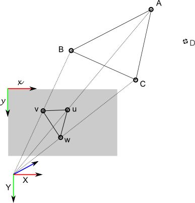

# PNP——Designed by 叶培楚

**算法流程**

1. 读取图像；

2. 读取相机内参和尺度因子；

3. 提取图像特征点；

4. 特征匹配并过滤错误匹配；

5. 从深度图为参考帧匹配的特征点提取深度值，并计算三维坐标；

6. 利用PNP计算相对姿态；（有三种策略可以选择，一种是直接利用OpenCV的PNPRansac方法，另一种是利用图优化的方法进行优化，最后一种是利用OpenCV的PNPRansac函数获取相对姿态初值，再利用图优化优化该姿态）

7. 误差估计。

**算法概述**

在本次代码中，笔者首先用OpenCV提供的solvePnPRansac(...)函数实现了PNP的基本功能，估算出了两帧间的相对运动，并利用RANSAC方法找出了内点。

RANSAC方法可以有效地找出满足相对姿态的最大内点集。通过随机提取几组点，估算出相对姿态，将所有点进行重投影验证相对姿态，统计内点数量。以此找出一组满足有最大内点数的相对姿态。

笔者利用g2o实现了一个非线性优化版本的PNP，通过构建非线性函数，以单位阵和零位移为初值，构建二元边（或一元边）生成图优化问题，进行优化。最终结果也是正确的。

因为非线性优化比较依赖于初值条件，假如初值与期望值差别较大，很容易得到错误解。因此我们通过将上述两种方法结合，先利用OpenCV的方法估算出相对姿态初值，再利用非线性优化对相对位姿进行优化。

PS： emmm... 在实现优化部分的代码时，因为对g2o不太熟悉，笔者花了一点时间。不过经验还是来源于一点一滴的积累。只要你付出过努力，收获总是会有的。

### PNP算法

&ensp; &ensp; 在视觉SLAM中，我们通常会有不同的观测数据。

&ensp; &ensp; 比如单目相机中，我们获取的两帧图像通常只有匹配的像素坐标，这时我们就只能利用[对极几何](https://www.cnblogs.com/yepeichu/p/12604678.html)来优化相对位姿，如果我们的特征点分布大体上接近一个平面，那么我们还可以估算两帧间的[单应矩阵](https://www.cnblogs.com/yepeichu/p/12612273.html)；

&ensp; &ensp; 如果我们有RGB-D相机，我们还可以获得匹配像素对应的深度信息，那么我们就得到了两组三维匹配点，这时就可以通过[ICP（迭代最近点）](https://www.cnblogs.com/yepeichu/p/12632767.html)来进行运动估计，ICP又分利用SVD分解和Bundle Adjustment两种方式，但是本质上并无区别，毕竟SVD也是构建非线性最小二乘问题。不过，Bundle Adjustment问题可以同时优化点和位姿。

&ensp; &ensp; 如果我们有一组三维点匹配二维点，这种类型的数据获取方式有多种。典型的是可以通过RBG-D来获取，前面我们提到RGB-D采集的数据可以用ICP进行优化位姿，实际上由于RGB-D相机本身的噪声，深度值估计是有误差的。因此在SLAM中通常会用PNP的方法来做估计，PNP也就是我们本讲要介绍的内容，利用一个带噪声的深度值进行位姿估计，总比用两个都带噪声的深度值来得合适些。另一种渠道是，单目三角化得到的地图点重投影到新帧中构建的PNP问题，原理一致。此外，还有双目图像。

&ensp; &ensp; 由于历史上的大牛众多，提供了多种千奇百怪的PNP算法，因此篇幅会有点长。笔者这也算是呕心沥血之作了，先把几个方法写出来先，然后再进入主题吧：
1. 直接线性变换（DLT）；
2. P3P;
3. EPNP;
4. 光束平差法（Bundle Adjustment）。

#### 已知条件

&ensp; &ensp; 匹配的 $n$ 组三维点-二维点：
$$P^{r} = \{P_{1}^{r}, P_{2}^{r}, \dots, P_{n}^{r}\}, p^{c} = \{p_{1}^{c}, p_{2}^{c}, \dots, p_{n}^{c}\}$$

其中，$P^{r}$ 表示参考帧中的三维点，$p^{c}$ 表示当前帧匹配的二维点（像素坐标）。数据获取方式如前面介绍的。

#### 问题

&ensp; &ensp; 在已知条件下，求解参考帧到当前帧的相对位姿。（旋转矩阵$R$ 和位移向量$t$）

#### 方法一：直接线性变换（DLT）

&ensp; &ensp; 直接线性变换与我们前面介绍的对极几何，单应矩阵的计算是类似的，都是忽略相对位姿本身的性质，直接将其视为一个数值矩阵，优化完才利用某些约束条件恢复相对运动。

&ensp; &ensp; 假设我们有一对匹配对：$P_{i}^{r} = [X, Y, Z, 1]^{T}$ 和 $p_{i}^{c} = [u, v, 1]^{T}$，两个坐标均为归一化坐标。假设相对位姿为：$T = [R | t]$，$p_{i}^{r}$ 的深度值为 $s$，则我们有：
$$
s
\begin{bmatrix}
u \\ v \\ 1
\end{bmatrix} = \begin{bmatrix} t_{1} & t_{2} & t_{3} & t_{4} \\
                                t_{5} & t_{6} & t_{7} & t_{8} \\
                                t_{9} & t_{10} & t_{11} & t_{12} \end{bmatrix} \begin{bmatrix} X \\ Y \\ Z \\ 1 \end{bmatrix}
$$

通过令 $T = \begin{bmatrix} t_{1}^{T} \\ t_{2}^{T} \\ t_{3}^{T} \end{bmatrix}$，则上式可以变成：
$$
s
\begin{bmatrix}
u \\ v \\ 1
\end{bmatrix} = \begin{bmatrix} t_{1}^{T} \\
                                t_{2}^{T} \\
                                t_{3}^{T} \end{bmatrix} \begin{bmatrix} X \\ Y \\ Z \\ 1 \end{bmatrix} = \begin{bmatrix} t_{1}^{T} \\
                                t_{2}^{T} \\
                                t_{3}^{T} \end{bmatrix} P_{i}^{c}
$$

可以得到：
$$
\begin{aligned}
u = \frac{t_{1}^{T}P_{i}^{c}}{t_{3}^{T}P_{i}^{c}} \\
v = \frac{t_{2}^{T}P_{i}^{c}}{t_{3}^{T}P_{i}^{c}}
\end{aligned}
$$

通过上述式子，我们去除了尺度因子的约束。进一步简化，我们得到两个约束条件：
$$
\begin{aligned}
-t_{3}^{T} u P_{i}^{c} + t_{1}^{T}P_{i}^{c} = 0 \Rightarrow \begin{bmatrix}P_{i}^{c} & 0 & -uP_{i}^{c} \end{bmatrix} \begin{bmatrix} t_{1}^{T} \\ t_{2}^{T} \\ t_{3}^{T}  \end{bmatrix}	 \\
-t_{3}^{T} v P_{i}^{c} + t_{2}^{T}P_{i}^{c} = 0 \Rightarrow \begin{bmatrix}0 & P_{i}^{c} & -vP_{i}^{c} \end{bmatrix} \begin{bmatrix} t_{1}^{T} \\ t_{2}^{T} \\ t_{3}^{T}  \end{bmatrix}	 \\
\end{aligned}
$$

由于相对位姿共有 $12$ 个未知数，因此至少需要六组匹配点，才能提供 $12$ 个约束条件用以解决这个问题。于是，我们构建了一个齐次方程：
$$AT = 0$$

矩阵 $A$ 是多组匹配点构成的约束条件，如果只有六组匹配点，则我们可以直接求得满足要求的解。如果不止六组点，那么我们就需要构建一个非线性方程来求解。这与我们先前介绍的对极几何，单应矩阵等利用SVD求解的方法一致。通过SVD分解，我们得到了 $12$ 维的 $T$ 矩阵。

&ensp; &ensp; 利用直接线性变换（DLT）估计的是一个射影变换，因为对于我们上述构建的问题，仅仅需要其满足一定的空间变换关系，而对于矩阵 $T$ 并没有更多的约束。实际上，由于 $T = [R | t]$，旋转矩阵需要满足一定的约束性质，因此需要进一步对解进行分析，比如QR分解,SVDf分解，将结果从矩阵空间重新投影到 $SE(3)$ 流形上，转换成旋转和平移两部分。

&ensp; &ensp; 很多博文基本上到这一步就没有后续了，默认大家都会了，可是实际上大部分的读者还是一脸懵逼，甚至人云亦云，就这样。实际上，后续的求解基本不清楚怎么做，笔者先前便是如此。通过查找资料，找到了一个知乎回答：[[PnP] PnP问题之DLT解法](https://zhuanlan.zhihu.com/p/58648937)，较好地解释了这个求解的问题。笔者简单的记录一下。

通过SVD分解，我们得到了 $T$ 的数值解，这个解是不带尺度的。“旋转矩阵”为：
$$\hat{R} = \begin{bmatrix} t_{1} & t_{2} & t_{3} \\ 
                      t_{5} & t_{6} & t_{7} \\ 
                      t_{9} & t_{10} & t_{11} \end{bmatrix}$$

同样，通过SVD分解：
$$\begin{bmatrix} U & \Sigma & V \end{bmatrix} = SVD(\hat{R})$$

于是我们可以得到旋转矩阵：
$$
\begin{aligned}
R_{1} = UV^{T} \\
R_{2} = -UV^{T}
\end{aligned}
$$

理论上，$\Sigma$ 的对角线应该非常接近，取均值，则尺度因子 $\beta$ 可以由下式得到：
$$\beta = \pm 1 / (tr(\Sigma) / 3)$$

于是，我们可以计算平移向量：
$$
\begin{aligned}
t_{1} = \beta_{1} \begin{bmatrix} t_{4} & t_{8} & t_{12} \end{bmatrix} \\
t_{2} = \beta_{2} \begin{bmatrix} t_{4} & t_{8} & t_{12} \end{bmatrix} 
\end{aligned}
$$

&ensp; &ensp; 通过上面的计算，我们得到了四组解，一说到有四组解，我们是不是想起了对极几何的操作？没错，我们还是一样利用点必须位于相机前方，即深度值必须为正这么一个约束对四组解进行验证，找到正确的解。

#### 方法二：P3P

&ensp; &ensp; 接下来，笔者要介绍另一种PNP方法：P3P，只用三组3D-2D匹配点加一组用于验证，对数据要求较少。

&ensp; &ensp; P3P的思路比较朴素，就是利用点的空间分布关系在不同相机坐标系下保持不变，以及相似三角形原理计算出参考帧三维点 $P_{i}^{c}$ 对应的参考帧三维点 $P_{i}^{r}$（实际上，参考帧只有二维点 $p_{i}^{r}$，因此才需要算三维点）。有了参考帧的三维空间点以及匹配的当前帧的三维空间点，我们可以构建一个类似于对极几何一般的约束问题，比如 $AE = b$，再分解出四组解，利用验证组选择正确的解。

&ensp; &ensp; 首先引入一个图：

上述描绘的是空间点$A_{w}, B_{w}, C_{w}$在当前相机坐标系下的对应点，对应像素坐标分别为$u, v, w$。设当前相机光心为 $O$，则可以得到三组相似三角形：
$$
\Delta Ouv \sim \Delta OAB, \Delta Ouw \sim \Delta OAC, \Delta Ovw \sim \Delta OBC
$$

利用余弦定理可以得到：
$$
\begin{aligned}
OA^{2} + OB^{2} - 2OA\cdot OB \cdot cos<ou, ov> = AB^{2} \\
OA^{2} + OC^{2} - 2OA\cdot OC \cdot cos<ou, ow> = AC^{2} \\
OB^{2} + OC^{2} - 2OB\cdot OC \cdot cos<ov, ow> = BC^{2}
\end{aligned}
$$

对上述所有式子除以 $OC^{2}$，并令$x = \frac{OA}{OC}, y = \frac{OB}{OC}$，可以得到：
$$
\begin{aligned}
x^{2} + y^{2} - 2x\cdot y \cdot cos<ou, ov> = \frac{AB^{2}}{OC^{2}} \\
x^{2} + 1 - 2x\cdot cos<ou, ow> = \frac{AC^{2}}{OC^{2}} \\
y^{2} + 1 - 2y\cdot cos<ov, ow> = \frac{BC^{2}}{OC^{2}}
\end{aligned}
$$

上述式子中，由于像素坐标已知，显然余弦值可求，而右边的式子中，$A, B, C$ 的空间关系也是已知的，但是我们不知道 $OA, OB, OC$　是未知的，前两项是待求，最后一项我们需要将他消除，则我们通过令：$a = \frac{AB^{2}}{OC^{2}}, ab = \frac{AC^{2}}{OC^{2}}, ac = \frac{BC^{2}}{OC^{2}}$，可以得到 $b = \frac{AC^{2}}{AB^{2}}, c = \frac{BC^{2}}{AB^{2}}$，我们可以将第一个式子带入其余两个式子中，以此消去 $OA$，即：
$$
\begin{aligned}
(1 - b)x^{2} -by^{2} + 1 - 2x\cdot cos<ou, ow> + 2b\cdot x\cdot y\cdot cos<ou, ov> = 0 \\
-cx^{2} + (1 - c)\cdot y^{2} + 1 - 2y\cdot cos<ov, ow> + 2b\cdot x\cdot y\cdot cos<ou, ov> = 0
\end{aligned}
$$

最后我们得到了两个二元二次方程，该方程比较复杂，需要使用一些特殊的求解方法，视觉SLAM十四讲中推荐的是使用吴消元法。具体的操作，笔者搜索到一篇博文[相机位姿求解——P3P问题](https://www.cnblogs.com/mafuqiang/p/8302663.html)提供了求解方法。得到 $x, y$ 后，我们将其代回原式子中，可以计算得到 $OA, OB, OC$。但我们需要求的是一个坐标点，而不单单是长度，因此还需要乘上一个单位方向向量。（笔者认为这个单位向量可以通过归一化平面的坐标与像素点坐标来计算）。

&ensp; &ensp; OK，通过上述方法，我们得到了三组点，于是我们利用类对极几何的方法计算出四组解，一组点可以提供三个约束条件，三组点刚好满足约束要求。于是我们利用第四组点进行验证，选择正确的解。至此，P3P的方法我们就介绍完毕了。

&ensp; &ensp; 有一点值得注意的是，P3P算法只要求3组点用于计算，1组点用于验证，再多的数据也用不了。很显然，如果我们选择的数据对存在噪声太大甚至是错误的，都会直接影响到最终结果。因此，实际上P3P也不是很好嘛，计算还那么难。笔者也提供一篇大家都在推荐的文章：Complete solution classification for the
perspective-three-point problem。实话说，笔者大概浏览了一下，就看不下去了。如果以后不是非得用到的情况下，笔者肯定不会再去碰它的了。

#### 方法三：EPNP

&ensp; &ensp; 前面我们介绍了P3P，接下来我们介绍EPNP。笔者EPNP部分主要参考两篇博客，其一是[深入EPnP算法](https://blog.csdn.net/jessecw79/article/details/82945918)，其二是[PNP(pespective-n-point)算法学习笔记](https://www.jianshu.com/p/b3e9fb2ad0dc)。第二篇博客主要是第一篇博客的整理版本，嗯，类似于我这一版差不多，加入了自己的理解。

&ensp; &ensp; EPNP相比P3P在模型上稍微复杂了一些，首先我们需要在参考帧中选择 $4$ 个不共面的控制点 $[c_{1}^{r}, c_{2}^{r}, c_{3}^{r}, c_{4}^{r}]$，假设参考帧中有一个点 $P_{i}^{r}$，那么该点可以用我们先前选出的控制点进行线性表出：
$$P_{i}^{r} = \sum_{j=1}^{4}(\alpha_{ij}\cdot c_{j}^{r})$$

且满足$\sum_{j=1}^{4}\alpha_{ij} = 1$，$\alpha_{ij}$ 是齐次barycentric坐标。同理，在当前帧坐标系下也满足：
$$P_{i}^{c} = \sum_{j=1}^{4}(\alpha_{ij}\cdot c_{j}^{c})$$

参考帧和当前帧之间的空间点满足约束关系：
$$P_{j}^{c} = \begin{bmatrix}R & t\end{bmatrix} \begin{bmatrix}P_{j}^{r} \\ 1\end{bmatrix} \Rightarrow \sum_{j=1}^{4}\alpha_{ij}c_{j}^{c} = \sum_{j=1}^{4}\alpha_{ij}\begin{bmatrix}R & t\end{bmatrix} \begin{bmatrix}c_{j}^{r} \\ 1\end{bmatrix}$$

为了得到精确解，而不是最小二乘拟合得到的解，于是我们需要引入 $4$ 组控制点。为了更加直观的看到空间点与我们选择的控制点间的关系：
$$\begin{bmatrix}P_{i}^{r} \\ 1 \end{bmatrix} = C \begin{bmatrix}\alpha_{i1} \\ \alpha_{i2} \\ \alpha_{i3} \\ \alpha_{i4} \end{bmatrix} = \begin{bmatrix}c_{1}^{r} & c_{2}^{r} & c_{3}^{r} & c_{4}^{r} \\ 1 & 1 & 1 & 1 \end{bmatrix} \begin{bmatrix}\alpha_{i1} \\ \alpha_{i2} \\ \alpha_{i3} \\ \alpha_{i4}  \end{bmatrix}$$ 

OK,进一步分析得到：
$$\begin{bmatrix}\alpha_{i1} \\ \alpha_{i2} \\ \alpha_{i3} \\ \alpha_{i4} \end{bmatrix} = C^{-1}\begin{bmatrix}P_{i}^{r} \\ 1 \end{bmatrix}$$

重点来了！那么我们在往下走之前，先分析一下我们目前可以得到的所有数据。已知数据是参考帧中有三维空间点一堆 $P^{r}$ 以及当前帧中对应的匹配像素坐标 $p^{c}$， 好像...没了？？嗯，是的。但是我们可以先假设，比如上面的东西我们部分已知呢？

&ensp; &ensp; 首先，参考帧中的四个控制点 $c_{i}^{r}$ 我们是可以选择的，因此可以视为已知的。那么我们知道控制点，也知道参考帧中的空间点，很显然我们可以求出barycentric坐标，即 $[\alpha_{i1}, \alpha_{i2}, \alpha_{i3}, \alpha_{i4}]^{T}$。就这么多已知的东西，没了吧？这次是真没了。而且我们还需要利用这些量，来计算当前帧相机坐标系下的四个控制点 $[c_{i1}^{c}, c_{i2}^{c}, c_{i3}^{c}, c_{i4}^{c}]$。

我们知道针孔相机的投影模型为：
$$s_{i}p_{i}^{c} = KP_{i}^{r} \Rightarrow s_{i}\begin{bmatrix}u_{i} \\ v_{i} \\ 1 \end{bmatrix} = \begin{bmatrix}f_{x} & 0 & c_{x} \\ 0 & f_{y} & c_{y} \\ 0 & 0 & 1 \end{bmatrix} \begin{bmatrix}X_{i}^{r} \\ Y_{i}^{r} \\ Z_{i}^{r} \end{bmatrix}$$

将控制点关系带入上述方程，并消去深度值 $s_{i}$，我们可以得到两个约束方程。不过值得注意的是，我们需要求解当前帧相机坐标系下的四个控制点，共计 $12$ 个未知数。于是我们又用老方法，把这些未知数拉成长条，解数值方程。最后还得利用空间点在外参变换下，空间关系不改变的约束，结合非线性优化来得到最终的控制点坐标。

最后，我们得到了当前帧和参考帧各自四个控制点，并且可以利用参考帧的空间点来计算barycentric坐标，那么我们显然可以利用：
$$P_{i}^{c} = \sum_{j=1}^{4}(\alpha_{ij}\cdot c_{j}^{c})$$

得到当前帧中匹配的空间点。于是乎，我们有了参考帧的三维坐标 $P^{r}$ 还有当前帧匹配的三维坐标 $P^{c}$，那么ICP走起！至此，我们EPNP的问题就解决了。[ICP](https://www.cnblogs.com/yepeichu/p/12632767.html)的内容我们之前介绍过了，这里就不赘述了。

&ensp; &ensp; 还有一点，实际上参考帧坐标系下的四个控制点只要不共面就行了，不过博文中还提供了另外一种选择控制点的方法，具体参考上述提到的两篇博文即可。

#### 方法四：光束平差法（Ｂundle Adjustment）

&ensp; &ensp; 前面那些理论都太难了，我们来点简单的。毕竟BA的套路还是比较固定的，通过构建一个非线性最小二乘法问题，选择优化方法对目标函数进行优化，最后就可以得到我们想要的结果。

&ensp; &ensp; BA方法唯一的障碍应该还是在求雅可比上。那我们还是先把问题描述一下吧。目标函数可以记为:
$$f(\xi) = \sum_{i}^{n}|| p_{i}^{c} - K\cdot exp(\xi^{\wedge})\cdot P_{i}^{r} ||^{2} = \sum_{i}^{n}|| e_{i}(\xi) ||^{2} $$

其中上述的点均采用齐次坐标，相机内参 $K \in R^{3 \times 4}$，$exp(\xi^{\wedge})$ 表示从参考帧坐标系到当前帧坐标系的相对变换。为了求解上述问题，我们需要先对该目标函数计算雅可比，首先简化问题：
$$e(\xi) = p_{i}^{c} - K\cdot exp(\xi^{\wedge})\cdot P_{i}^{r} = p_{i}^{c} - K\cdot P_{i}^{C} = p_{i}^{r} - p_{i}^{c}$$

其中，$P_{i}^{C}$ 表示通过将参考帧坐标系的点转换到当前坐标系下得到的，于是我们的雅可比可以通过链式法则计算：
$$\frac{\partial{e}}{\partial{\xi}} = \frac{\partial{e}}{\partial{p_{i}^{c}}} \cdot \frac{\partial{p_{i}^{c}}}{\partial{P_{i}^{C}}} \cdot \frac{\partial{P_{i}^{C}}}{\partial{\xi}}$$

第一步求解 $\frac{\partial{e}}{\partial{P_{i}^{C}}}$，设 $P_{i}^{C} = [x_{i}^{C}, y_{i}^{C}, z_{i}^{C}, 1]^{T}$，通过针孔模型相机的投影模型，可以很简单的计算出雅可比：

$$\frac{\partial{e}}{\partial{P_{i}^{C}}} = \frac{\partial{e}}{\partial{p_{i}^{c}}} \cdot \frac{\partial{p_{i}^{c}}}{\partial{P_{i}^{C}}} = 
(-1) \cdot \begin{bmatrix} x_{i}^{C}f_{x} & 0 & -\frac{x_{i}^{C}\cdot f_{x}}{(z_{i}^{C})^{2}} \\ 0 & y_{i}^{C}f_{y} & -\frac{y_{i}^{C}\cdot f_{y}}{(z_{i}^{C})^{2}} 
\end{bmatrix}$$

接下来是计算 $\frac{\partial{P_{i}^{C}}}{\partial{\xi}}$，由于旋转矩阵不具备加法封闭性，利用直接求导的话，尽管有BCH近似可以用，但是会引入一个计算比较复杂的雅可比。因此，本文还是更倾向于使用扰动模型，这也是大部分程序中使用的方法：
$$
\begin{aligned}
\frac{\partial{P_{i}^{C}}}{\partial{\xi}} =& \frac{exp(\delta \xi^{\wedge})exp(\xi^{\wedge})P_{i}^{r} - exp(\xi^{\wedge})P_{i}^{r}}{\delta \xi} \\
\approx & \frac{(1 + \delta \xi^{\wedge})exp(\xi^{\wedge})P_{i}^{r} - exp(\xi^{\wedge})P_{i}^{r}}{\delta \xi} \\
=& \frac{(\delta \xi^{\wedge})exp(\xi^{\wedge})P_{i}^{r}}{\delta \xi} \\
=& \frac{\begin{bmatrix} \delta \phi^{\wedge} & \delta \rho \\ 0^{T} & 0 \end{bmatrix} \begin{bmatrix} RP_{i}^{r} + t \\ 1 \end{bmatrix} }{\delta \xi} \\ 
=& \frac{\begin{bmatrix} \delta \phi^{\wedge}(RP_{i}^{r} + t) + \delta \rho \\ 0 \end{bmatrix} }{\delta \xi} \\ 
=& \frac{\begin{bmatrix} -(RP_{i}^{r} + t)^{\wedge}\delta \phi + \delta \rho \\ 0 \end{bmatrix} }{\delta \xi} \\
=& \frac{\begin{bmatrix} -(RP_{i}^{r} + t)^{\wedge}\delta \phi + \delta \rho \\ 0 \end{bmatrix} }{\delta \xi} \\
=& \frac{\begin{bmatrix} -(RP_{i}^{r} + t)^{\wedge} & I \\ 0^{T} & 0^{T} \end{bmatrix} \begin{bmatrix} \delta \phi \\ \delta \rho \end{bmatrix} }{\delta \xi} \\
=& \begin{bmatrix} -(RP_{i}^{r} + t)^{\wedge} & I \\ 0^{T} & 0^{T} \end{bmatrix} \\
=& (TP_{i}^{r})^{\odot}
\end{aligned}
$$

其中，有 $exp(\xi^{\wedge}) = T = \begin{bmatrix}R & t \\ 0^{T} & 1\end{bmatrix}$，$\delta \xi = \begin{bmatrix} \delta \phi \\ \delta \rho \end{bmatrix}$。当然你也可以选择位移在前，旋转在后，那么雅可比的顺序就需要調整一下。

通过上述的计算，我们可以知道$\frac{\partial{e}}{\partial{\xi}}$：
$$
\frac{\partial{e}}{\partial{\xi}} = - \begin{bmatrix} x_{i}^{C}f_{x} & 0 & -\frac{x_{i}^{C}\cdot f_{x}}{(z_{i}^{C})^{2}} \\ 0 & y_{i}^{C}f_{y} & -\frac{y_{i}^{C}\cdot f_{y}}{(z_{i}^{C})^{2}} \end{bmatrix} (TP_{i}^{r})^{\odot}
$$

具体的笔者就不展开了，反正就那么代进去算就对了。于是我们这里就算出了位姿的雅可比矩阵。那么优化问题就很简单了，通过对目标函数中的各个残差进行一阶泰勒展开，并对展开后的残差进行一阶导数即可得到一个正规方程：$H\Delta x = b$，具体也没啥好说的，非线性优化的内容就那样推呗。具体可以参考[学习笔记之——P3P与ICP位姿估计算法及实验](https://blog.csdn.net/gwplovekimi/article/details/89844563)。OK，那么非线性优化的方法也介绍完了。

#### 参考资料

1. [g2o定义边](https://blog.csdn.net/weixin_42905141/article/details/100830126)
2. [SLAM之李群李代数工具](http://www.mathsword.com/slam_se3_so3/)
3. [李代数求导](http://www.mathsword.com/diff_se3_so3/)
4. [李代数的导数](https://blog.csdn.net/qq_40007147/article/details/103349460)
5. [相机位姿求解问题？](https://www.zhihu.com/question/51510464)
6. [3D-2D相机位姿估计](https://www.jianshu.com/p/f16e5b5cc47d) 
7. [特征法前端（二）](https://zhuanlan.zhihu.com/p/35519429)
8. [视觉SLAM十四讲]
9. [[PnP] PnP问题之DLT解法](https://zhuanlan.zhihu.com/p/58648937)
10. [相机位姿求解——P3P问题](https://www.cnblogs.com/mafuqiang/p/8302663.html)
11. [学习笔记之——P3P与ICP位姿估计算法及实验](https://blog.csdn.net/gwplovekimi/article/details/89844563)
12. X.-S. Gao, X.-R. Hou, J. Tang, and H.-F. Cheng, “Complete solution classification for the perspective-three-point problem,” IEEE Transactions on Pattern Analysis and Machine Intelligence, vol. 25, pp. 930–943, Aug 2003.
13. [深入EPnP算法](https://blog.csdn.net/jessecw79/article/details/82945918)
14. [PNP(pespective-n-point)算法学习笔记](https://www.jianshu.com/p/b3e9fb2ad0dc)