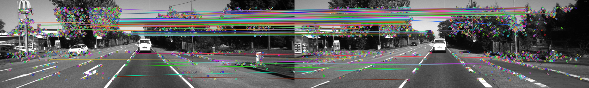
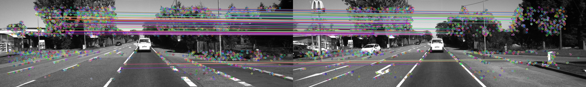

# FeatureMatching by 叶培楚

### 代码内容介绍
通过FeatureMatching类将特征提取的内容封装起来。

**匹配方法主要包括：**
1. Flann快速最近邻搜索匹配法;
2. BruteForce暴力匹配法.

*PS: 想要使用SIFT, SURF和BRIEF需要安装Opencv-contrib包。*

**代码流程：**
1. 输入并读取图像；
2. 设置特征点类型，类型为std::string，比如"ORB","SIFT"等，支持的特征点类型详见FeatureExtraction/README.md;
3. 创建特征提取类并输入图像和设置特征点类型；
4. 进行特征提取，此处可以选择划分图像提取还是用OpenCV原始方法提取；
5. 重新设置图像，再次提取，完成两张图像的特征提取；
6. 创建特征匹配类，并设置特征点类型和匹配方法；
7. 进行特征匹配；
8. 显示。

PS：在main.cpp函数中，切换匹配方法时，显示函数需要更改，否则会报错！

### 特征匹配

&ensp; &ensp; 特征匹配，又可以称之为数据关联。在图像领域中，特征匹配的作用非常大。比如：
1. 在图像拼接中，需要进行特征匹配，方便求出单应矩阵以拼接两幅图像；
2. 在三维重建中，需要进行特征匹配，方便求出变换矩阵以及三角化特征点；
3. 在图像检索中，可以通过特征点在数据库中检索，查找到特征匹配数量最多的识别结果；
...

&ensp; &ensp; 检索部分暂时不提，毕竟涉及到了复杂的数据结构。并且在SLAM中用的并不多，虽然在回环检测中需要用到。但是，这是后续的事情了。

> 特征匹配的前提：

**特征描述子的特异性和可重复性：** 特征描述子是在图像中利用邻域信息对关键点进行描述，得到一组描述向量。通常对于两帧具有部分重复纹理的地方，同一个位置的特征描述子应该是一样的。但是由于光照、遮挡、旋转和尺度等变化，导致同样的地方看起来却又不太一样。但是总体来说，只要是同一个地方，特征描述子的差别就不应该太大。

**相似度度量方法：** 基于这个事实，特征匹配的目的就是在两个有重复纹理的图像中，将同一个位置的特征描述子关联起来。通常特征描述子是一组向量，比如 $x = {x_1, x_2, ...,x_n}$，同理，另一张图像中的同个位置描述向量为 $y = {y_1, y_2, ..., y_n} $，将其在超平面中画出来，就可以通过度量其距离来判断其相似度。比如 $n = 2/3$ 时，在坐标系中画出来，可以非常直观的看出来两个向量的距离。

> 特征匹配的方法：

&ensp; &ensp; 在本文中，只介绍两种常用的方法。
1. Flann快速最近邻搜索匹配法；
2. BruteForce暴力匹配法；

**暴力匹配法**

&ensp; &ensp; 假设两帧图像 $I_{1}, I_{2}$ 中，各自提取了 $500$ 个特征点，暴力匹配法通过对图像 $I_{1}$ 中任意一个特征点 $f_{i}^{1}$，都与图像 $I_{2}$ 中的所有特征点计算匹配分数。相似度度量方法如前所述，通过对每对特征点计算欧式距离（ORB度量汉明距离），选择与当前特征点 $f_{i}^{1}$ 欧式距离最短的特征点作为最优匹配。

&ensp; &ensp; 暴力匹配法让图像 $I_{1}$ 中的所有特征点都能在图像 $I_{2}$ 中找到匹配点，这也是其被称之为暴力匹配法的原因。

&ensp; &ensp;　很明显，这样的匹配方法尽管可以获得足够多的匹配对，但是掺杂着非常多的错误匹配，这些错误匹配在后续的应用当中会导致不可挽回的后果。（没错，就算用全局优化也很难救回来的那种）试想一下，在SLAM当中，由于出现了很多错误匹配，在估计帧间相对运动时，进行非线性优化算约束时，因为错误匹配约束的加入，将导致帧间运动估计错误，甚至不收敛。

&ensp; &ensp; 而经过实践，人们发现可以用经验值来将这些错误的匹配尽可能的过滤掉。比如特征点间的距离小于最大距离的一半，或者大于最小距离的两倍等。对初始匹配进行一次过滤，可以得到较好的匹配结果。比如下图所示：

&ensp; &ensp; 暴力匹配法，通常搜索时间是 $O(n)$，即 $1$ 对 $n$。不仅搜索效率比较低，并且其匹配效果比较差。

**快速最近邻搜索匹配法**

&ensp; &ensp; 快速最近邻搜索匹配是相比暴力匹配法，在搜索策略上有所改进。
&ensp; &ensp; FLANN的搜索匹配主要分两步，第一步便是建立索引，第二步是根据索引进行搜索。
1. 索引方式包括：线性索引、KD-Tree索引、K均值索引、复合索引、LSH方法索引、自动索引六种。具体介绍可以详见：[OpenCV——KD Tree](https://blog.csdn.net/ErenTuring/article/details/72983405?depth_1-utm_source=distribute.pc_relevant.none-task&utm_source=distribute.pc_relevant.none-task)。
2. 搜索方式包括：搜索K近邻，搜索半径近邻。搜索K近邻可以指定返回查询到的最相似的几个。而搜索半径近邻可以设置搜索半径，在搜索半径中找匹配点。

&ensp; &ensp; FLANN匹配效率根据索引类型有所变化，比如选择线性的搜索索引时，就是暴力匹配法。而如果选择KD-tree作为索引时，就会有对数级的匹配效率，相比暴力匹配法有所提高。此外，匹配效果也有所提高。比如下图所示：

参考资料：
1. [OpenCV探索之路（二十三）：特征检测和特征匹配方法汇总](https://www.cnblogs.com/skyfsm/p/7401523.html)； 
2. [FLANN特征匹配](https://blog.csdn.net/weixin_41887615/article/details/93176456);
3. [OpenCV——KD Tree](https://blog.csdn.net/ErenTuring/article/details/72983405?depth_1-utm_source=distribute.pc_relevant.none-task&utm_source=distribute.pc_relevant.none-task);
4. [OpenCV的最近邻开源库FLANN](https://www.jianshu.com/p/d70d9c8b2bec).
