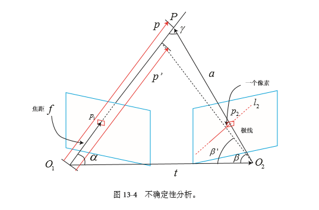

# TriangularPoints by 叶培楚

### 代码内容介绍
通过TriangularPoints类将特征提取的内容封装起来。

**三角化主要包括**
1. ORB-SLAM中的三角化方法;
2. VINS-MONO中的三角化方法;
3. OpenCV自带的TriangulatePoints三角化方法; ——源码中的计算方式同方法1和2相同
4. 根据理论推导出来的三角化方法。——Mid-Point Method
PS：但是4中的方法似乎得到的结果跟前三种方法深度不一样...

**代码流程**
1. 读取两帧图像；
2. 对两帧图像分别提取特征点；
3. 特征匹配；
4. 利用经验值优化匹配结果并显示匹配；
5. 计算相对运动（本质矩阵或基础矩阵）；
6. 三角化点；
7. 归一化所有点；
8. 输出深度值。

### 三角化原理

#### 三角化的目的

&ensp; &ensp; 在视觉SLAM当中，所用的传感器大体可以分为三种，单目，双目和RGB-D相机。（当然，像事件相机和鱼眼相机那些我们暂时不考虑）

&ensp; &ensp; **RGB-D相机**可以同时获取环境的彩色图像和深度图像，直接知道环境的距离深度信息。在室内的小环境中，RGB-D可以非常方便地帮助我们节省非常多的计算资源。但是遗憾的是，RGB-D相机受光照的影响较大，很难应用于室外环境；

&ensp; &ensp; **双目相机**的好处是可以通过固定基线的双目图像计算环境的深度信息。不同于RGB-D相机，双目图像可探测的距离取决于基线的长度以及分辨率，且对于光照变化的敏感度也稍微低一些。缺陷是需要耗费较多的计算资源来计算环境的深度信息。细想一下，一帧图像如果有三十万个像素点，那么每一个像素点需要在右帧极线上搜索匹配点，并对其进行三角化，才能得到最终的深度值，那得是多恐怖的事情！当然，视觉SLAM不可能用这么坑爹的方法，不然匹配时间就太长了。通常我们会选择一些特征点来代表这个图像，对特征点进行三角化来计算深度值是更加合理的方法。值得注意的是，本文所说的三角化和静态双目的三角化不太一样。静态双目的三角化是通过基线baseline和焦距以及计算出来的视差值来计算得到的。即z = bf / d。另外，现在很多相机厂商都很努力地将双目恢复深度的计算集成到FPGA中，利用硬件加速来计算深度值，这非常值得期待;

&ensp; &ensp; **单目相机**的好处是只需要一个相机，成本较低，操作也比较简单。遗憾的是，正因为只有一个相机，缺少深度值，因此就丢失了绝对尺度信息。这也是本文着重介绍的方法，利用相邻帧或者有匹配点的两个图像，来估算空间点的深度值。但是这个深度值与真实空间中相差一个尺度因子。

&ensp; &ensp; *可以看到，在上述的描述中，单目相机如果想要恢复空间点的深度值，绝对离不开三角化操作。三角化的目的就是通过帧间数据关联，利用约束条件恢复空间信息，从而实现三维重建的目的。*

#### 三角化原理

&ensp; &ensp; **已知条件：** 两帧图像 $I_{1}$ 和 $I_{2}$ 中有多组特征匹配点，假设其中任意一组特征点对为 $f_{1}$ 和 $f_{2}$，对应的深度值分别为 $z_{1}$ 和 $z_{2}$，其构建了一个空间点 $p_{w}$。相机内参数为 $K$，由于我们采集的两帧图像为同一相机采集的，因此两帧图像的内参数相同。图像 $I_{1}$ 的外参变换 $T_{1w}$ 表示从世界坐标系变换到图像 $I_{1}$ 坐标系中，同理有 $T_{2w}$。

&ensp; &ensp; **约束条件**：已知相机的投影投影方程如下：
$$z_{1}f_{1} = KT_{1w}p_{w}$$
其中，$f_{1} = \begin{bmatrix}
    u_{1} \\
    v_{1} \\
    1
\end{bmatrix}$，$T_{1w} = \begin{bmatrix}
    R_{1w} & t_{1w} \\
    0^T & 1 
\end{bmatrix}$，$K = \begin{bmatrix}
    f_{x} & 0 & c_{x} & 0 \\
    0 & f_{y} & c_{y} & 0 \\
    0 & 0 & 1 & 0 
\end{bmatrix}$，$p_{w} = \begin{bmatrix}
    x_{w} \\
    y_{w} \\
    z_{w} \\
    1 
\end{bmatrix}$

&ensp; &ensp; **计算方法**：通过令投影矩阵 $P = KT_{1w}$，则有 $z_{1}f_{1} = Pp_{w}$，通过两边叉乘 $f_{1}$，则有：
$$z_{1}f_{1} \times f_{1} = 0 = f_{1} \times Pp_{w}$$
其中，$f_{1}\times = \begin{bmatrix}
    0 & -1 & v_{1} \\
    1 & 0 & -u_{1} \\
    -v_{1} & u_{1} & 0 
\end{bmatrix}$，令$P = \begin{bmatrix}
    P_{1} \\
    P_{2} \\
    P_{3}
\end{bmatrix}$，可以构造矩阵：
$$H_{1} = \begin{bmatrix}
    v_{1}P_{3} - P2 \\
    u_{1}P_{3} - P1 \\
    u_{1}P_{2} - v_{1}P1 
\end{bmatrix}$$

同理，可以得到 $H_{2}$，因此我们可以构建最小二乘优化函数 $min(Hp_{w})$，其中 $H = \begin{bmatrix}
    H_{1} \\
    H_{2} \\
\end{bmatrix}$。通过对其进行SVD分解，$H$ 的最小奇异值对应的解即为使得目标函数取得最小值的解。该解为 $V$ 矩阵的最后一列。解法可以参考我的另一篇博文——[ORBSLAM特征点的三角化](https://www.cnblogs.com/yepeichu/p/10792899.html),这篇博文主要只是为了回顾一下三角化的知识点。欢迎参考。
对应本文的代码已上传github，对应[TriangularPoints](https://github.com/yepeichu123/slam_module/tree/master/triangularPoints).

&ensp; &ensp; **Tips**：值得注意的是，尽管我们每个特征点可以提供三个约束条件，但是实际上第三个约束条件是与前两个约束条件线性相关的，我通过将其添加到约束条件中，会得出不一样的深度值，因此很多算法的三角化都会把第三个约束条件去掉。两个特征点形成四个约束条件，比如ORB-SLAM和VINS-MONO。在ORB-SLAM2中， 我们可以看到 $H$ 矩阵跟实际公式推导的结果符号不一致，这完全没有影响。因为我们的方程为 $Hp_{w} = 0$，不管我们在其左右两端乘上什么东西，结果都一样。

#### 三角化误差分析

&ensp; &ensp; 此部分内容参考视觉SLAM十四讲以及博文[三角化---深度滤波器---单目稠密重建（高翔slam---十三讲）](https://www.cnblogs.com/Jessica-jie/p/7730731.html)。
&ensp; &ensp; **三角化的误差衡量标准是指，在正确的匹配条件下，匹配点偏移一个像素点所带来的深度值偏差。通常需要偏移一个像素点，深度值改变的量越小越好，表示估计出来的深度越准确。**
&ensp; &ensp; 如图所示，其中空间点为 $P$, 两帧图像的相机光心分别为 $O_{1}$ 和 $O_{2}$，相对变化为 $R_{12}$, $t_{12}$，焦距为 $f$，空间点 $P$ 在两帧图像中的投影点分别为 $p_{1}$ 和 $p_{2}$， $l_{2}$ 为投影点 $p_{2}$ 所在的极线。$p$ 和 $a$ 以及 $t$ 分别表示向量。除此之外还有如图所示的角度。

根据三角形几何知识，我们有以下约束条件：
1. $a = p - t$
2. $\alpha = arccos<p, t>$
3. $\beta = arccos<a, -t>$

其中，$\alpha$，$\beta$ 表示如图所示的角度。
&ensp; &ensp; 如图所示，我们在右边的图像中延极线方向取与 $p_{2}$ 偏差一个像素的点 $p_{2}^{'}$。由于偏离了一个像素，同时影响了夹角 $\beta$，假设变化后的夹角 $\beta$ 为 $\beta^{'}$，很明显 $\gamma$ 也会变化。因此，我们可以得到如下约束条件：

4. $\delta\beta = arctan( 1/{f})$ (这一步可以看右图中，两个直角边分别为偏移的一个像素和焦距)
5. $\beta^{'} = \beta - \delta\beta$
6. $\gamma = \pi - \alpha - \beta^{'}$

由正弦公式可以得到：

7. $||p^{'}|| = ||t||sin\beta^{'} / sin\gamma$ 

三角化的深度误差为：

8. $\delta p = ||p|| - ||p^{'}||$

&ensp; &ensp; 到此为止，我们已经分析了如何计算三角化误差。可以看到，如果我们希望三角化的深度误差非常小，那么一个非常直观的方法就是增加基线的长度，或者是两帧之间的位移。但是遗憾的是，当两帧间的位移增加时，图像会出现旋转和尺度等变化，导致外观上的不一致性，从而影响特征匹配等。因此，三角化是矛盾的。除此之外，如果我们的像素偏移足够小，匹配位置非常准确（亚像素），那么我们需要分辨率更高的图像，同时对该图像提取特征点和匹配时需要耗费的计算资源更多，因此这也是一个需要取舍的地方。

### 参考资料

1. [SLAM--三角化求解3D空间点](https://blog.csdn.net/qq_37611824/article/details/93210012?depth_1-utm_source=distribute.pc_relevant.none-task&utm_source=distribute.pc_relevant.none-task)
2. [三角测量恢复深度](https://blog.csdn.net/zhubaohua_bupt/article/details/74926111)
3. [三角化---深度滤波器---单目稠密重建（高翔slam---十三讲）](https://www.cnblogs.com/Jessica-jie/p/7730731.html)
4. [OpenCV实现SfM（二）：双目三维重建](https://blog.csdn.net/aichipmunk/article/details/48157369)
5. [（七）ORBSLAM特征点的三角化](https://www.cnblogs.com/yepeichu/p/10792899.html)
